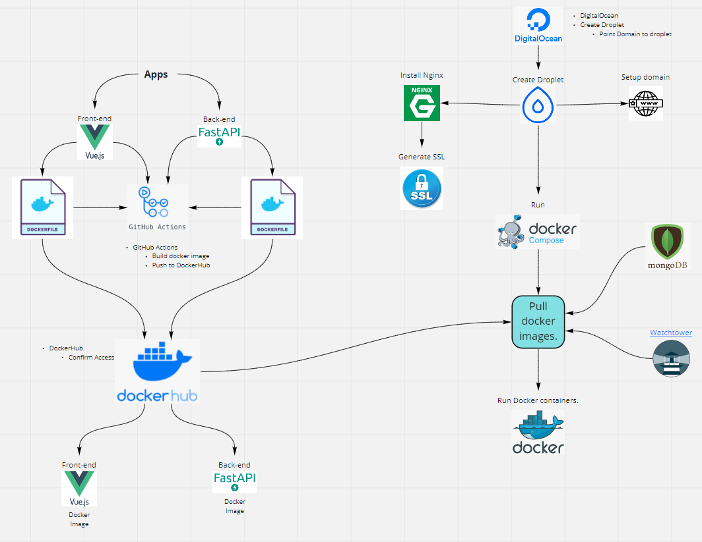

# fastapi-vue3-docker-workflow
Stubbing out and documenting FastAPI, VueJS 3 and Docker workflow.

## Punchlist
- [x] Create sample vue frontend
  - From frontend DIR, [Vue CLI create project](https://cli.vuejs.org/guide/creating-a-project.html#vue-create) (Installed in same DIR and selected default Vue3)
  - yarn serve and [http://localhost:8080/](http://localhost:8080/)
- [X] Push to Git
- [X] Create Dockerfile to run Vue from Docker
  - From frontend DIR, [create Docker image](https://cli.vuejs.org/guide/deployment.html#docker-nginx)
  - docker build . -t frontend
  - docker run -d -p 8080:80 frontend
- [x] Create GitAction to build docker image and push to dockerhub
  - Confirm image arrived at private [hub.docker.com](https://hub.docker.com/)
- [x] Create [DigitalOcean](digitalocean.com) Droplet for <domain.com>
- [x] Setup Shell access
  - ([nice instructions](https://youtu.be/hf8wUUrGCgU?list=PLFBirL3MAv29JsC0G3ARt0fNWoK2PAdI6&t=205))
  - use [puttygen](https://www.ssh.com/ssh/putty/windows/puttygen) to convert private key to <privateKey>.ppk
- [x] Replace ubuntu prompt
  - PS1=$
- [ ] Create user
  - adduser larry
  - adduser larry sudo
  - sudo su - larry
- [ ] Github runner
  - Nice
  - [github actions](https://github.com/LarryEitel/fastapi-vue3-docker-workflow/settings/actions)
    - Add runner following instructions
  
- [x] Docker Prep
  - mkdir /root/devops
  - cd /root/devops
  - docker login
  - pull image
    - docker pull larryeitel/fastapi-vue3-docker-workflow
  - run container and verify
    - docker run -d -p 8080:80 larryeitel/fastapi-vue3-docker-workflow
    - [http://<dropletIP>:8080/](http://<dropletIP>:8080/)
- [ ] [Install nginx](https://www.digitalocean.com/community/tutorials/how-to-install-nginx-on-ubuntu-18-04)
  - sudo apt update
  - sudo apt install nginx
  - ufw allow 'Nginx HTTP'
  - ufw delete allow 'Nginx HTTP'
  - Confirm server is running
    - systemctl status nginx
  - Key nginx commands
    - systemctl stop nginx
    - systemctl start nginx
    - systemctl restart nginx
    - systemctl reload nginx
    - systemctl disable nginx
    - systemctl enable nginx
    - systemctl status nginx.service
  - Visit droplet IP to see NGINX page.
  - Configure nginx
    - ln -s /etc/nginx/sites-available/<domain> /etc/nginx/sites-enabled/<domain>
  - Update snap
      - snap install core; sudo snap refresh core
  - snap install --classic certbot

- [X] Generate SSL
  - Check ubuntu version: cat /etc/os-release
  - Visit [Certbot](https://www.digitalocean.com/community/tutorials/how-to-secure-nginx-with-let-s-encrypt-on-ubuntu-20-04)
  - certbot --nginx -d example.com -d www.example.com
  - Verify `systemctl status certbot.timer`

Inspired by [Deploying a Web App with Docker & Github Actions](https://www.youtube.com/watch?v=JsOoUrII3EY&list=PLFBirL3MAv29JsC0G3ARt0fNWoK2PAdI6&index=1)
